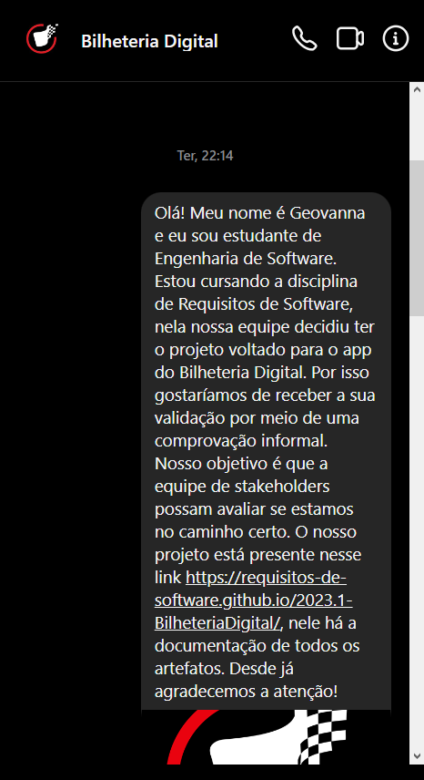
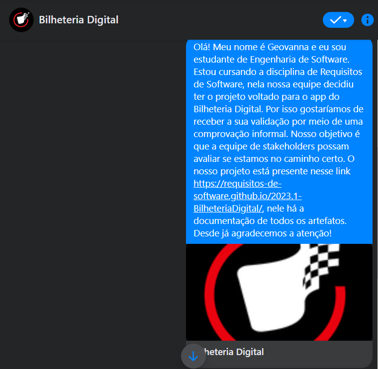

# Comprovação Informal

## Introdução

Chegada na fase de validação, que é a fase de confirmação de que o produto é aquele desejado pelo usuário <a id="REF1" href="#anchor_1">^1^</a>, uma das estratégias tomadas para o projeto foi a comprovação informal. Ela é uma descrição em linguagem natural para que os clientes possam identificar problemas na expressão dos requisitos <a id="REF1" href="#anchor_1">^1^</a>. No caso do Bilheteria Digital, foi preferível entrar em contato com a empresa para obter a validação.

## Método de comunicação
Para realizar a validação, foram enviadas mensagens em plataformas diferentes de contato, o e-mail foi escolhido como o canal principal para transmitir a mensagem, mas também foram utilizadas as redes sociais como um meio adicional para abordar a questão. 

É importante destacar que, devido à natureza formal do assunto em questão, a mensagem enviada por e-mail adotou uma abordagem mais estruturada e solene. A escolha desse meio de comunicação foi motivada pela necessidade de transmitir claramente informações técnicas e detalhadas relacionadas aos artefatos produzidos.

Por outro lado, as mensagens enviadas pelas redes sociais tiveram uma abordagem ligeiramente mais informal. Embora o objetivo final tenha sido o mesmo - obter uma validação da Bilheteria Digital - o uso das redes sociais permite uma interação mais direta e casual entre as partes envolvidas. Esse canal pode ser aproveitado para fornecer atualizações rápidas, compartilhar ideias e esclarecer dúvidas de forma mais ágil.

Portanto, a combinação desses dois meios de comunicação - e-mail e redes sociais - proporcionou uma abordagem abrangente e eficaz para alcançar o objetivo comum de obter a validação da Bilheteria Digital. As figuras de 1 a 3 mostram a mensagem enviada nas plataformas supracitadas. Todas foram enviadas no dia 20 de junho no horário de 22h.

**Figura 1** - Mensagem por e-mail.

<figure markdown>{: style="height:250px;width:950px"}

Fonte: [Geovanna Maciel](https://github.com/manuziny)

**Figura 2** - Mensagem pelo Instagram.

<figure markdown>{: style="height:550px;width:395px"}

Fonte: [Geovanna Maciel](https://github.com/manuziny)

**Figura 3** - Mensagem pelo Facebook.

<figure markdown>{: style="height:550px;width:500px"}

Fonte: [Geovanna Maciel](https://github.com/manuziny)

## Retorno do Bilheteria Digital
Até o momento da entrega do artefato (21/06/2023) não foram obtidas respostas de validação. Caso a equipe entre em contato por alguma rede social, será inserido neste artefato sua comprovação informal quanto ao que foi desenvolvido no projeto.

## Referências Bibliográficas

> <a id="anchor_1" href="#REF1">1.</a> SERRANO, Milene. Requisitos - Aula 23. 2017. Apresentação de slides. Disponível em: https://aprender3.unb.br/pluginfile.php/2523157/mod_resource/content/2/Requisitos - Aula 023.pdf. Acesso em: 20 de jun de 2023.

## Histórico de Vesões

| Versão | Data | Descrição | Autor(es) | Revisor(es) |
| --- | --- | --- | --- | --- |
| 1.0 | 20/06/2023 | Criação da documentação | [Geovanna Maciel](https://github.com/manuziny) | [Sidney Fernando](https://github.com/nando3d3) |

